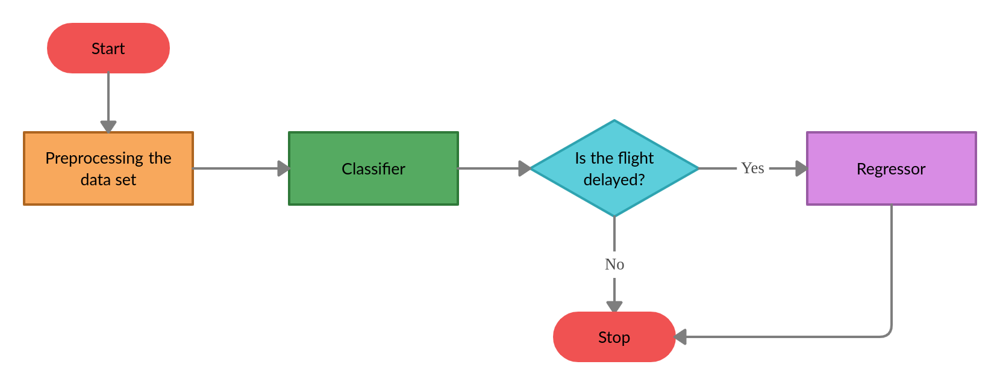

# Flight_Delay_Prediction
A two stage predictive machine learning engine that forecasts the on-time performance of flights for 15 different airports in the USA based on data collected between 2016 and 2017.

- Check out the two-stage machine learning model [here!](./12_Pipelined_Model.ipynb)
- Check out the details of the project in this [Report!](./Report/Two_Stage_Flight_Delay_Prediction_Report_Nivedhitha.pdf)

## Abstract
Flights are said to be delayed when they arrive later than the scheduled arrival time. This delay is predominantly influenced by environmental conditions. Flight delay is vexatious for passengers and also incurs an agonizingly high financial loss to airlines and countries. A structured prediction system is an indispensable tool that can help aviation authorities effectively alleviate flight delays. This project aims to build a two-stage machine learning engine to effectively predict the arrival delay of a flight in minutes after departure based on real-time
flight and weather data. A classifier first predicts if the flight will be delayed or not and subsequently a regression model predicts the arrival delay in minutes if the flight is expected to be delayed.

## Code Walkthrough
1. [Data directory setup](./01_Data_Directory_Setup.ipynb)
2. [Flight data pre-processing](./02_Flight_Data_Processing.ipynb)
3. [Weather data pre-processing](./03_Weather_Data_Processing.ipynb)
4. [Merging the flight and weather data](./04_Merging_Flight_and_Weather_Data.ipynb)
5. [Classifying flights as delayed or on-time](./05_Classification.ipynb)
6. [Study of ways to handle class imbalance in the data set](./06_Handling_Imbalance.ipynb)
7. [Random Under-sampling](./07_Random_Under_Sampling.ipynb)
8. [Random Over-sampling](./08_Random_Over_Sampling.ipynb)
9. [Synthetic Minority Over-sampling TEchnique (SMOTE)](./09_SMOTE.ipynb)
10. [Comparison of the different sampling techniques to handle imbalance](./10_Classification_Inference.ipynb)
11. [Regression model to predict the arrival delay in minutes](./11_Regression.ipynb)
12. [Final implementation of the two-stage machine learning model to predict flight delay](./12_Pipelined_Model.ipynb)

## Result
The flight and weather data were combined into a single data set and pre-processed to train a two-stage machine learning model that predicts flight arrival delay. Due to class imbalance, there was an inherent bias towards the majority class, ’Not Delayed’ flights (class 0). The data was sampled using SMOTE before classification to overcome the bias. Out of five different algorithms, the Random Forest classifier gave the best F1 score (0.78) and Recall (0.74) for the delayed flights. Subsequently, the Random Forest regressor was pipe-lined, giving MAE 7.178 minutes and RMSE 11.283 minutes with an R2 score of 0.977. In conclusion, the flight delay prediction was efficient and the Machine Learning model exhibited good performance.

# Installation Requirements
## Environment
It is recommended to have a Linux or macOS development environment for convenience, although the code runs on Windows 10.  
Use Anaconda to manage your packages and Python 3 (version >= 3.8.0 recommended).  
It is also recommended to run the code on <strong>Jupyter Notebook</strong>.

## Dependencies
### With Anaconda, no need to install
- matplotlib
- scikit-learn
- numpy
- pandas
### Others
Remember to use conda, not pip for installing these
- missingno
- imblearn
### Latex for documentation - Ubuntu
- texlive-full
